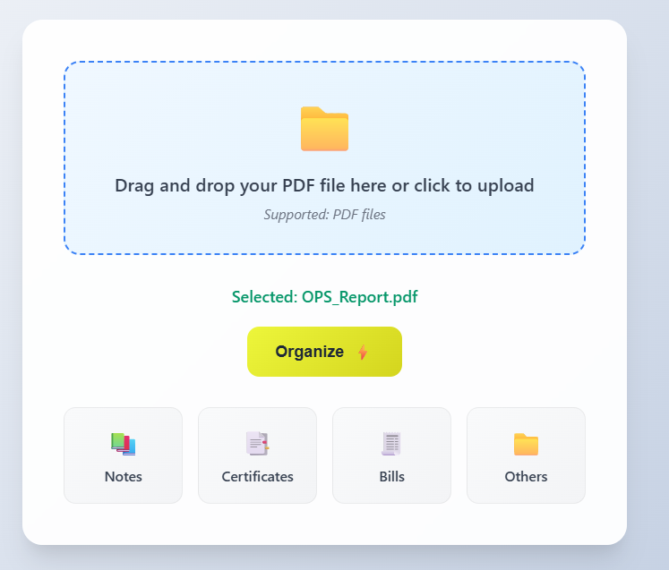

# 📂 DocSort – Smart Document Organizer

✨ *Click, Sort, Relax – Looks like your files just found their happy place.*

DocSort is an intelligent file organizer that allows users to upload PDF documents, automatically classifies them using AI, and places them into appropriate folders like **notes**, **certificates**, **bills**, or **others**. It uses a zero-shot classification model from Hugging Face, meaning no dataset or retraining is needed.

---

## 🚀 Features

- ✅ Drag & Drop PDF file upload
- ✅ One-click "Organize" button to classify files
- ✅ Zero-shot document classification using `facebook/bart-large-mnli`
- ✅ Files stored in folders by category
- ✅ Clickable category boxes to view sorted files
- ✅ Fully integrated frontend & backend (HTML/JS + FastAPI)

---

## 🧠 Tech Stack

- **Frontend**: HTML, CSS, JavaScript
- **Backend**: FastAPI (Python)
- **Machine Learning**: Hugging Face Transformers (Zero-Shot Classification)
- **PDF Text Extraction**: pdfplumber or PyMuPDF

---
---
## 🛠️ Installation

1. **Clone the repository**
   ```bash
   git clone https://github.com/your-username/youtube-rag-chatbot.git
   cd youtube-rag-chatbot
   ```

2. **Set up virtual environment**
   ```bash
   python -m venv venv
   source venv/bin/activate  
   ```

3. **Install dependencies**
   ```bash
   pip install -r requirements.txt
   ```

---

## 🧪 How to Use

1. Run the app file:
   ```bash
   python backend/main.py
   ```

2. Upload the file.

3. Click organize to organize the document.

---

## 📸 Screenshots

### 🔹 Home Page


### 🔹 File upload


### 🔹 Organized Success Message


---

## 🛠️ Future Improvements

- Allow users to search for a specific file across all categories.

- Add basic authentication so users can manage their own classified files securely.

- Store files in Google Drive / S3 instead of local folders for scalability.

- Train or fine-tune the classification model on user-uploaded samples for better accuracy.

---

## 🤝 Contributing

Pull requests are welcome! For major changes, please open an issue first to discuss what you would like to change.

---

## 📜 License

This project is licensed under the MIT License.

---
